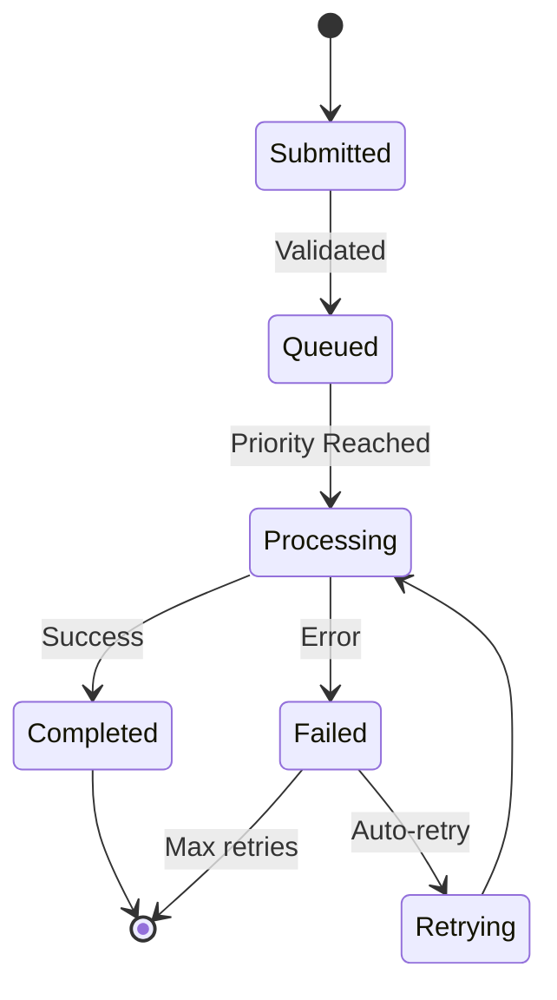
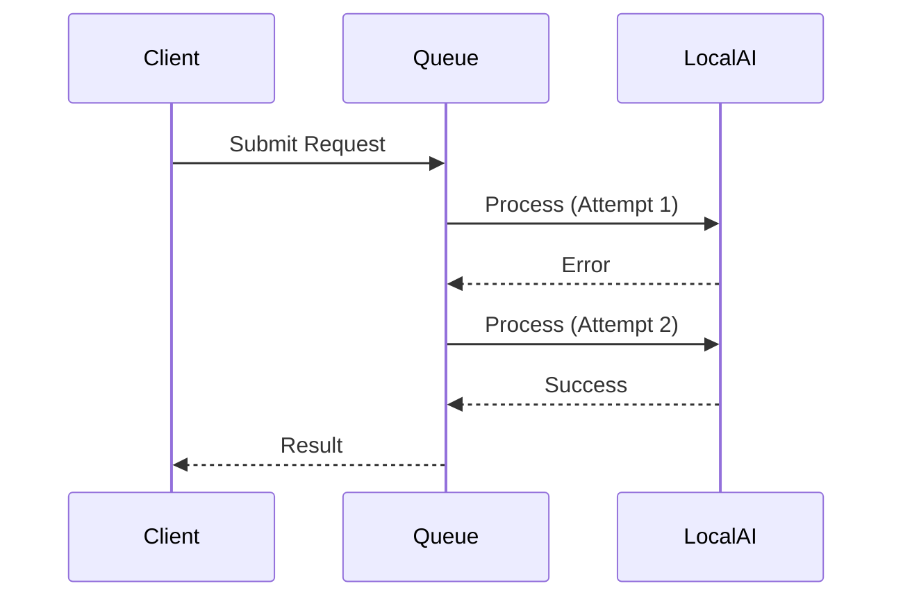
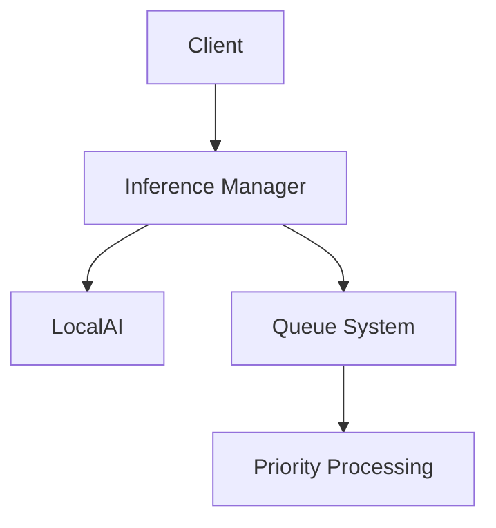

# Inference Manager Developer Guide

## System Architecture Overview

The Inference Manager is a FastAPI application that provides queue-based inference services for LocalAI models. Key components:

## Queue Processing

The queue system manages inference requests with priority-based processing and comprehensive monitoring.

### Queue Lifecycle

1. **Request Submission**:
   - Requests validated and added to model-specific queues
   - Future object created for async response

2. **Priority Processing**:
   - Requests processed in priority order: txt2txt > txt2img > img2img > img2txt
   - Within each type, FIFO ordering

3. **Execution**:
   - Request sent to LocalAI API
   - Processing time recorded

4. **Completion**:
   - Result returned via Future
   - Metrics recorded



### Priority Handling

- Higher priority requests preempt lower priority ones
- Priority determined by request type (see `priority_order` in queues.py)
- Critical requests (e.g. chat) prioritized over batch jobs

### Error Recovery

- Errors recorded with sanitized parameters
- Automatic retry for transient errors
- Error metrics available via `/mcp/get_error_metrics`
- Recent errors logged (last 100)



### Monitoring Integration

Key metrics collected:
- Queue wait times
- Processing times
- Error rates by type/model
- Throughput counts

Available via:
- `/mcp/get_request_metrics`
- `/mcp/get_error_metrics`

### Performance Considerations

- Queue lengths impact wait times
- Processing time varies by model
- Monitor metrics to scale appropriately

### Troubleshooting Queue Issues

1. **Stuck Requests**:
   - Check LocalAI health
   - Verify model files exist
   - Review error metrics

2. **High Error Rates**:
   - Check model compatibility
   - Review recent errors for patterns

3. **Slow Processing**:
   - Monitor queue lengths
   - Check LocalAI resource usage
   - Consider scaling

## Component Descriptions

### Core Components

- `main.py`: FastAPI application setup and endpoints
- `src/models/queues.py`: Queue management and metrics
- `src/routes/mcp.py`: MCP server with inference tools
- `src/utils/localai_client.py`: LocalAI API client

### Request Types

- `Txt2TxtRequest`: Text generation (chat completion)
- `Txt2ImgRequest`: Image generation from text
- `Img2ImgRequest`: Image modification
- `Img2TxtRequest`: Image description

## Request Processing Flow

1. Client makes request to MCP tool (e.g. `/mcp/txt2txt`)
2. Request validated and added to appropriate queue
3. Queue processor picks up request in priority order:
   ```mermaid
   graph TD
     A[Request Received] --> B[Validate Model]
     B --> C[Create Request Object]
     C --> D[Add to Queue]
     D --> E[Process in Priority Order]
     E --> F[Call LocalAI API]
     F --> G[Return Result]
   ```
4. Result returned to client via Future

## Queue Management

- **Priority Order**: txt2txt > txt2img > img2img > img2txt
- **Metrics Collected**:
  - Queue wait times
  - Processing times
  - Error rates
  - Throughput

## Setup Instructions

1. Install dependencies:
   ```bash
   pip install -r requirements.txt
   ```

2. Configure LocalAI URL (optional):
   ```bash
   export LOCALAI_URL=http://your-localai-instance:8080
   ```

3. Start the server:
   ```bash
   uvicorn main:app --host 0.0.0.0 --port 8000
   ```

## Configuration Options

Environment Variables:
- `LOCALAI_URL`: LocalAI API base URL (default: http://localhost:8080)

API Configuration:
- See `pyproject.toml` for FastAPI settings
- Queue priorities in `src/models/queues.py`

## Troubleshooting

### Common Issues

1. **Model Not Found**:
   - Verify model files exist in `models/` directory
   - Check model names match those in `queues.py`

2. **Timeout Errors**:
   - Check LocalAI server health
   - Monitor queue lengths with `/queue-status`

3. **High Error Rates**:
   - Check `/mcp/get_error_metrics` for details
   - Review logs in `app.log`

## Best Practices

1. **Monitoring**:
   - Regularly check `/health` and `/queue-status`
   - Monitor error metrics via `/mcp/get_error_metrics`

2. **Performance**:
   - Keep queue lengths manageable
   - Scale based on metrics from `/mcp/get_request_metrics`

3. **Development**:
   - Add new models to `model_sets` in `queues.py`
   - Follow existing patterns for new request types

## API Documentation

See inline documentation in:
- `src/routes/mcp.py` for MCP tools
- `main.py` for core API endpoints

## Diagrams

### System Architecture


### Request Lifecycle
```mermaid
sequenceDiagram
  participant Client
  participant Manager
  participant Queue
  participant LocalAI
  
  Client->>Manager: POST /mcp/txt2txt
  Manager->>Queue: Add Request
  Queue->>LocalAI: Process Request
  LocalAI-->>Queue: Return Result
  Queue-->>Manager: Fulfill Future
  Manager-->>Client: Return Response