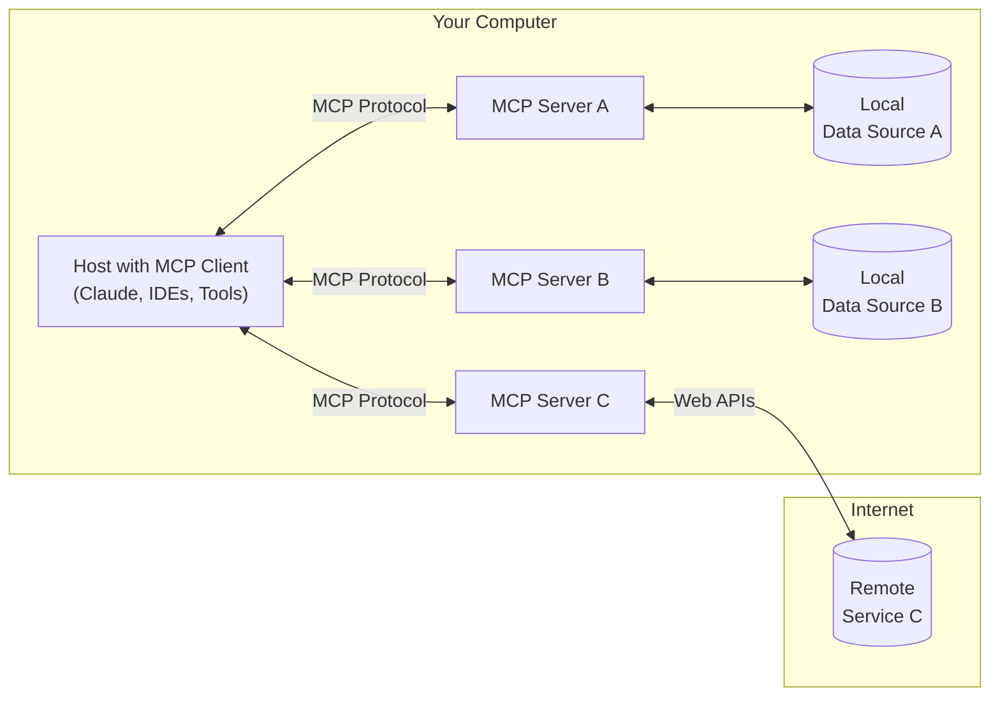

# Introduction

> Get started with the Model Context Protocol (MCP)

MCP is an open protocol that standardizes how applications provide context to LLMs. Think of MCP like a USB-C port for AI applications. Just as USB-C provides a standardized way to connect your devices to various peripherals and accessories, MCP provides a standardized way to connect AI models to different data sources and tools.

## Why MCP?

MCP helps you build agents and complex workflows on top of LLMs. LLMs frequently need to integrate with data and tools, and MCP provides:

* A growing list of pre-built integrations that your LLM can directly plug into
* The flexibility to switch between LLM providers and vendors
* Best practices for securing your data within your infrastructure

### General architecture

At its core, MCP follows a client-server architecture where a host application can connect to multiple servers:



* **MCP Hosts**: Programs like Claude Desktop, IDEs, or AI tools that want to access data through MCP
* **MCP Clients**: Protocol clients that maintain 1:1 connections with servers
* **MCP Servers**: Lightweight programs that each expose specific capabilities through the standardized Model Context Protocol
* **Local Data Sources**: Your computer's files, databases, and services that MCP servers can securely access
* **Remote Services**: External systems available over the internet (e.g., through APIs) that MCP servers can connect to

# For Server Developers

> Get started building your own server to use in Claude for Desktop and other clients.

In this tutorial, we'll build a simple MCP weather server and connect it to a host, Claude for Desktop. We'll start with a basic setup, and then progress to more complex use cases.

### What we'll be building

Many LLMs do not currently have the ability to fetch the forecast and severe weather alerts. Let's use MCP to solve that!

We'll build a server that exposes two tools: `get-alerts` and `get-forecast`. Then we'll connect the server to an MCP host (in this case, Claude for Desktop)

### Core MCP Concepts

MCP servers can provide three main types of capabilities:

1. **Resources**: File-like data that can be read by clients (like API responses or file contents)
2. **Tools**: Functions that can be called by the LLM (with user approval)
3. **Prompts**: Pre-written templates that help users accomplish specific tasks

This tutorial will primarily focus on tools.

Let's get started with building our weather server! [You can find the complete code for what we'll be building here.](https://github.com/modelcontextprotocol/quickstart-resources/tree/main/weather-server-python)

    ### Prerequisite knowledge

    This quickstart assumes you have familiarity with:

    * Python
    * LLMs like Claude

    ### System requirements

    * Python 3.10 or higher installed.
    * You must use the Python MCP SDK 1.2.0 or higher.

    ### Set up your environment

    First, let's install `uv` and set up our Python project and environment:

    <CodeGroup>
      ```bash MacOS/Linux
      curl -LsSf https://astral.sh/uv/install.sh | sh
      ```

      ```powershell Windows
      powershell -ExecutionPolicy ByPass -c "irm https://astral.sh/uv/install.ps1 | iex"
      ```
    </CodeGroup>

    Make sure to restart your terminal afterwards to ensure that the `uv` command gets picked up.

    Now, let's create and set up our project:

    <CodeGroup>
      ```bash MacOS/Linux
      # Create a new directory for our project
      uv init weather
      cd weather

      # Create virtual environment and activate it
      uv venv
      source .venv/bin/activate

      # Install dependencies
      uv add "mcp[cli]" httpx

      # Create our server file
      touch weather.py
      ```

      ```powershell Windows
      # Create a new directory for our project
      uv init weather
      cd weather

      # Create virtual environment and activate it
      uv venv
      .venv\Scripts\activate

      # Install dependencies
      uv add mcp[cli] httpx

      # Create our server file
      new-item weather.py
      ```
    </CodeGroup>

    Now let's dive into building your server.

    ## Building your server

    ### Importing packages and setting up the instance

    Add these to the top of your `weather.py`:

    ```python
    from typing import Any
    import httpx
    from mcp.server.fastmcp import FastMCP

    # Initialize FastMCP server
    mcp = FastMCP("weather")

    # Constants
    NWS_API_BASE = "https://api.weather.gov"
    USER_AGENT = "weather-app/1.0"
    ```

    The FastMCP class uses Python type hints and docstrings to automatically generate tool definitions, making it easy to create and maintain MCP tools.

    ### Helper functions

    Next, let's add our helper functions for querying and formatting the data from the National Weather Service API:

    ```python
    async def make_nws_request(url: str) -> dict[str, Any] | None:
        """Make a request to the NWS API with proper error handling."""
        headers = {
            "User-Agent": USER_AGENT,
            "Accept": "application/geo+json"
        }
        async with httpx.AsyncClient() as client:
            try:
                response = await client.get(url, headers=headers, timeout=30.0)
                response.raise_for_status()
                return response.json()
            except Exception:
                return None

    def format_alert(feature: dict) -> str:
        """Format an alert feature into a readable string."""
        props = feature["properties"]
        return f"""
    Event: {props.get('event', 'Unknown')}
    Area: {props.get('areaDesc', 'Unknown')}
    Severity: {props.get('severity', 'Unknown')}
    Description: {props.get('description', 'No description available')}
    Instructions: {props.get('instruction', 'No specific instructions provided')}
    """
    ```

    ### Implementing tool execution

    The tool execution handler is responsible for actually executing the logic of each tool. Let's add it:

    ```python
    @mcp.tool()
    async def get_alerts(state: str) -> str:
        """Get weather alerts for a US state.

        Args:
            state: Two-letter US state code (e.g. CA, NY)
        """
        url = f"{NWS_API_BASE}/alerts/active/area/{state}"
        data = await make_nws_request(url)

        if not data or "features" not in data:
            return "Unable to fetch alerts or no alerts found."

        if not data["features"]:
            return "No active alerts for this state."

        alerts = [format_alert(feature) for feature in data["features"]]
        return "\n---\n".join(alerts)

    @mcp.tool()
    async def get_forecast(latitude: float, longitude: float) -> str:
        """Get weather forecast for a location.

        Args:
            latitude: Latitude of the location
            longitude: Longitude of the location
        """
        # First get the forecast grid endpoint
        points_url = f"{NWS_API_BASE}/points/{latitude},{longitude}"
        points_data = await make_nws_request(points_url)

        if not points_data:
            return "Unable to fetch forecast data for this location."

        # Get the forecast URL from the points response
        forecast_url = points_data["properties"]["forecast"]
        forecast_data = await make_nws_request(forecast_url)

        if not forecast_data:
            return "Unable to fetch detailed forecast."

        # Format the periods into a readable forecast
        periods = forecast_data["properties"]["periods"]
        forecasts = []
        for period in periods[:5]:  # Only show next 5 periods
            forecast = f"""
    {period['name']}:
    Temperature: {period['temperature']}°{period['temperatureUnit']}
    Wind: {period['windSpeed']} {period['windDirection']}
    Forecast: {period['detailedForecast']}
    """
            forecasts.append(forecast)

        return "\n---\n".join(forecasts)
    ```

    ### Running the server

    Finally, let's initialize and run the server:

    ```python
    if __name__ == "__main__":
        # Initialize and run the server
        mcp.run(transport='stdio')
    ```

    Your server is complete! Run `uv run weather.py` to confirm that everything's working.

    Let's now test your server from an existing MCP host, Claude for Desktop.

    ## Testing your server with Claude for Desktop

    <Note>
      Claude for Desktop is not yet available on Linux. Linux users can proceed to the [Building a client](/quickstart/client) tutorial to build an MCP client that connects to the server we just built.
    </Note>

    First, make sure you have Claude for Desktop installed. [You can install the latest version
    here.](https://claude.ai/download) If you already have Claude for Desktop, **make sure it's updated to the latest version.**

    We'll need to configure Claude for Desktop for whichever MCP servers you want to use. To do this, open your Claude for Desktop App configuration at `~/Library/Application Support/Claude/claude_desktop_config.json` in a text editor. Make sure to create the file if it doesn't exist.
    For example, if you have [VS Code](https://code.visualstudio.com/) installed:
    ```bash
        code ~/Library/Application\ Support/Claude/claude_desktop_config.json
    ```
    You'll then add your servers in the `mcpServers` key. The MCP UI elements will only show up in Claude for Desktop if at least one server is properly configured.

    In this case, we'll add our single weather server like so:
    ```json Python
        {
            "mcpServers": {
                "weather": {
                    "command": "uv",
                    "args": [
                        "--directory",
                        "/ABSOLUTE/PATH/TO/PARENT/FOLDER/weather",
                        "run",
                        "weather.py"
                    ]
                }
            }
        }
    ```
    <Warning>
      You may need to put the full path to the `uv` executable in the `command` field. You can get this by running `which uv` on MacOS/Linux or `where uv` on Windows.
    </Warning>

    <Note>
      Make sure you pass in the absolute path to your server.
    </Note>

    This tells Claude for Desktop:

    1. There's an MCP server named "weather"
    2. To launch it by running `uv --directory /ABSOLUTE/PATH/TO/PARENT/FOLDER/weather run weather.py`

    Save the file, and restart **Claude for Desktop**.

# MCP Python SDK

<div align="center">

<strong>Python implementation of the Model Context Protocol (MCP)</strong>

[![PyPI][pypi-badge]][pypi-url]
[![MIT licensed][mit-badge]][mit-url]
[![Python Version][python-badge]][python-url]
[![Documentation][docs-badge]][docs-url]
[![Specification][spec-badge]][spec-url]
[![GitHub Discussions][discussions-badge]][discussions-url]

</div>

<!-- omit in toc -->
## Table of Contents

- [MCP Python SDK](#mcp-python-sdk)
  - [Overview](#overview)
  - [Installation](#installation)
    - [Adding MCP to your python project](#adding-mcp-to-your-python-project)
    - [Running the standalone MCP development tools](#running-the-standalone-mcp-development-tools)
  - [Quickstart](#quickstart)
  - [What is MCP?](#what-is-mcp)
  - [Core Concepts](#core-concepts)
    - [Server](#server)
    - [Resources](#resources)
    - [Tools](#tools)
    - [Prompts](#prompts)
    - [Images](#images)
    - [Context](#context)
  - [Running Your Server](#running-your-server)
    - [Development Mode](#development-mode)
    - [Claude Desktop Integration](#claude-desktop-integration)
    - [Direct Execution](#direct-execution)
    - [Mounting to an Existing ASGI Server](#mounting-to-an-existing-asgi-server)
  - [Examples](#examples)
    - [Echo Server](#echo-server)
    - [SQLite Explorer](#sqlite-explorer)
  - [Advanced Usage](#advanced-usage)
    - [Low-Level Server](#low-level-server)
    - [Writing MCP Clients](#writing-mcp-clients)
    - [MCP Primitives](#mcp-primitives)
    - [Server Capabilities](#server-capabilities)
  - [Documentation](#documentation)
  - [Contributing](#contributing)
  - [License](#license)

[pypi-badge]: https://img.shields.io/pypi/v/mcp.svg
[pypi-url]: https://pypi.org/project/mcp/
[mit-badge]: https://img.shields.io/pypi/l/mcp.svg
[mit-url]: https://github.com/modelcontextprotocol/python-sdk/blob/main/LICENSE
[python-badge]: https://img.shields.io/pypi/pyversions/mcp.svg
[python-url]: https://www.python.org/downloads/
[docs-badge]: https://img.shields.io/badge/docs-modelcontextprotocol.io-blue.svg
[docs-url]: https://modelcontextprotocol.io
[spec-badge]: https://img.shields.io/badge/spec-spec.modelcontextprotocol.io-blue.svg
[spec-url]: https://spec.modelcontextprotocol.io
[discussions-badge]: https://img.shields.io/github/discussions/modelcontextprotocol/python-sdk
[discussions-url]: https://github.com/modelcontextprotocol/python-sdk/discussions

## Overview

The Model Context Protocol allows applications to provide context for LLMs in a standardized way, separating the concerns of providing context from the actual LLM interaction. This Python SDK implements the full MCP specification, making it easy to:

- Build MCP clients that can connect to any MCP server
- Create MCP servers that expose resources, prompts and tools
- Use standard transports like stdio and SSE
- Handle all MCP protocol messages and lifecycle events

## Installation

### Adding MCP to your python project

We recommend using [uv](https://docs.astral.sh/uv/) to manage your Python projects. 

If you haven't created a uv-managed project yet, create one:

   ```bash
   uv init mcp-server-demo
   cd mcp-server-demo
   ```

   Then add MCP to your project dependencies:

   ```bash
   uv add "mcp[cli]"
   ```

Alternatively, for projects using pip for dependencies:
```bash
pip install "mcp[cli]"
```

### Running the standalone MCP development tools

To run the mcp command with uv:

```bash
uv run mcp
```

## Quickstart

Let's create a simple MCP server that exposes a calculator tool and some data:

```python
# server.py
from mcp.server.fastmcp import FastMCP

# Create an MCP server
mcp = FastMCP("Demo")


# Add an addition tool
@mcp.tool()
def add(a: int, b: int) -> int:
    """Add two numbers"""
    return a + b


# Add a dynamic greeting resource
@mcp.resource("greeting://{name}")
def get_greeting(name: str) -> str:
    """Get a personalized greeting"""
    return f"Hello, {name}!"
```

You can install this server in [Claude Desktop](https://claude.ai/download) and interact with it right away by running:
```bash
mcp install server.py
```

Alternatively, you can test it with the MCP Inspector:
```bash
mcp dev server.py
```

## What is MCP?

The [Model Context Protocol (MCP)](https://modelcontextprotocol.io) lets you build servers that expose data and functionality to LLM applications in a secure, standardized way. Think of it like a web API, but specifically designed for LLM interactions. MCP servers can:

- Expose data through **Resources** (think of these sort of like GET endpoints; they are used to load information into the LLM's context)
- Provide functionality through **Tools** (sort of like POST endpoints; they are used to execute code or otherwise produce a side effect)
- Define interaction patterns through **Prompts** (reusable templates for LLM interactions)
- And more!

## Core Concepts

### Server

The FastMCP server is your core interface to the MCP protocol. It handles connection management, protocol compliance, and message routing:

```python
# Add lifespan support for startup/shutdown with strong typing
from contextlib import asynccontextmanager
from collections.abc import AsyncIterator
from dataclasses import dataclass

from fake_database import Database  # Replace with your actual DB type

from mcp.server.fastmcp import Context, FastMCP

# Create a named server
mcp = FastMCP("My App")

# Specify dependencies for deployment and development
mcp = FastMCP("My App", dependencies=["pandas", "numpy"])


@dataclass
class AppContext:
    db: Database


@asynccontextmanager
async def app_lifespan(server: FastMCP) -> AsyncIterator[AppContext]:
    """Manage application lifecycle with type-safe context"""
    # Initialize on startup
    db = await Database.connect()
    try:
        yield AppContext(db=db)
    finally:
        # Cleanup on shutdown
        await db.disconnect()


# Pass lifespan to server
mcp = FastMCP("My App", lifespan=app_lifespan)


# Access type-safe lifespan context in tools
@mcp.tool()
def query_db(ctx: Context) -> str:
    """Tool that uses initialized resources"""
    db = ctx.request_context.lifespan_context.db
    return db.query()
```

### Resources

Resources are how you expose data to LLMs. They're similar to GET endpoints in a REST API - they provide data but shouldn't perform significant computation or have side effects:

```python
from mcp.server.fastmcp import FastMCP

mcp = FastMCP("My App")


@mcp.resource("config://app")
def get_config() -> str:
    """Static configuration data"""
    return "App configuration here"


@mcp.resource("users://{user_id}/profile")
def get_user_profile(user_id: str) -> str:
    """Dynamic user data"""
    return f"Profile data for user {user_id}"
```

### Tools

Tools let LLMs take actions through your server. Unlike resources, tools are expected to perform computation and have side effects:

```python
import httpx
from mcp.server.fastmcp import FastMCP

mcp = FastMCP("My App")


@mcp.tool()
def calculate_bmi(weight_kg: float, height_m: float) -> float:
    """Calculate BMI given weight in kg and height in meters"""
    return weight_kg / (height_m**2)


@mcp.tool()
async def fetch_weather(city: str) -> str:
    """Fetch current weather for a city"""
    async with httpx.AsyncClient() as client:
        response = await client.get(f"https://api.weather.com/{city}")
        return response.text
```

### Prompts

Prompts are reusable templates that help LLMs interact with your server effectively:

```python
from mcp.server.fastmcp import FastMCP
from mcp.server.fastmcp.prompts import base

mcp = FastMCP("My App")


@mcp.prompt()
def review_code(code: str) -> str:
    return f"Please review this code:\n\n{code}"


@mcp.prompt()
def debug_error(error: str) -> list[base.Message]:
    return [
        base.UserMessage("I'm seeing this error:"),
        base.UserMessage(error),
        base.AssistantMessage("I'll help debug that. What have you tried so far?"),
    ]
```

### Images

FastMCP provides an `Image` class that automatically handles image data:

```python
from mcp.server.fastmcp import FastMCP, Image
from PIL import Image as PILImage

mcp = FastMCP("My App")


@mcp.tool()
def create_thumbnail(image_path: str) -> Image:
    """Create a thumbnail from an image"""
    img = PILImage.open(image_path)
    img.thumbnail((100, 100))
    return Image(data=img.tobytes(), format="png")
```

### Context

The Context object gives your tools and resources access to MCP capabilities:

```python
from mcp.server.fastmcp import FastMCP, Context

mcp = FastMCP("My App")


@mcp.tool()
async def long_task(files: list[str], ctx: Context) -> str:
    """Process multiple files with progress tracking"""
    for i, file in enumerate(files):
        ctx.info(f"Processing {file}")
        await ctx.report_progress(i, len(files))
        data, mime_type = await ctx.read_resource(f"file://{file}")
    return "Processing complete"
```

## Running Your Server

### Development Mode

The fastest way to test and debug your server is with the MCP Inspector:

```bash
mcp dev server.py

# Add dependencies
mcp dev server.py --with pandas --with numpy

# Mount local code
mcp dev server.py --with-editable .
```

### Claude Desktop Integration

Once your server is ready, install it in Claude Desktop:

```bash
mcp install server.py

# Custom name
mcp install server.py --name "My Analytics Server"

# Environment variables
mcp install server.py -v API_KEY=abc123 -v DB_URL=postgres://...
mcp install server.py -f .env
```

### Direct Execution

For advanced scenarios like custom deployments:

```python
from mcp.server.fastmcp import FastMCP

mcp = FastMCP("My App")

if __name__ == "__main__":
    mcp.run()
```

Run it with:
```bash
python server.py
# or
mcp run server.py
```

### Mounting to an Existing ASGI Server

You can mount the SSE server to an existing ASGI server using the `sse_app` method. This allows you to integrate the SSE server with other ASGI applications.

```python
from starlette.applications import Starlette
from starlette.routing import Mount, Host
from mcp.server.fastmcp import FastMCP


mcp = FastMCP("My App")

# Mount the SSE server to the existing ASGI server
app = Starlette(
    routes=[
        Mount('/', app=mcp.sse_app()),
    ]
)

# or dynamically mount as host
app.router.routes.append(Host('mcp.acme.corp', app=mcp.sse_app()))
```

For more information on mounting applications in Starlette, see the [Starlette documentation](https://www.starlette.io/routing/#submounting-routes).

## Examples

### Echo Server

A simple server demonstrating resources, tools, and prompts:

```python
from mcp.server.fastmcp import FastMCP

mcp = FastMCP("Echo")


@mcp.resource("echo://{message}")
def echo_resource(message: str) -> str:
    """Echo a message as a resource"""
    return f"Resource echo: {message}"


@mcp.tool()
def echo_tool(message: str) -> str:
    """Echo a message as a tool"""
    return f"Tool echo: {message}"


@mcp.prompt()
def echo_prompt(message: str) -> str:
    """Create an echo prompt"""
    return f"Please process this message: {message}"
```

### SQLite Explorer

A more complex example showing database integration:

```python
import sqlite3

from mcp.server.fastmcp import FastMCP

mcp = FastMCP("SQLite Explorer")


@mcp.resource("schema://main")
def get_schema() -> str:
    """Provide the database schema as a resource"""
    conn = sqlite3.connect("database.db")
    schema = conn.execute("SELECT sql FROM sqlite_master WHERE type='table'").fetchall()
    return "\n".join(sql[0] for sql in schema if sql[0])


@mcp.tool()
def query_data(sql: str) -> str:
    """Execute SQL queries safely"""
    conn = sqlite3.connect("database.db")
    try:
        result = conn.execute(sql).fetchall()
        return "\n".join(str(row) for row in result)
    except Exception as e:
        return f"Error: {str(e)}"
```

## Advanced Usage

### Low-Level Server

For more control, you can use the low-level server implementation directly. This gives you full access to the protocol and allows you to customize every aspect of your server, including lifecycle management through the lifespan API:

```python
from contextlib import asynccontextmanager
from collections.abc import AsyncIterator

from fake_database import Database  # Replace with your actual DB type

from mcp.server import Server


@asynccontextmanager
async def server_lifespan(server: Server) -> AsyncIterator[dict]:
    """Manage server startup and shutdown lifecycle."""
    # Initialize resources on startup
    db = await Database.connect()
    try:
        yield {"db": db}
    finally:
        # Clean up on shutdown
        await db.disconnect()


# Pass lifespan to server
server = Server("example-server", lifespan=server_lifespan)


# Access lifespan context in handlers
@server.call_tool()
async def query_db(name: str, arguments: dict) -> list:
    ctx = server.request_context
    db = ctx.lifespan_context["db"]
    return await db.query(arguments["query"])
```

The lifespan API provides:
- A way to initialize resources when the server starts and clean them up when it stops
- Access to initialized resources through the request context in handlers
- Type-safe context passing between lifespan and request handlers

```python
import mcp.server.stdio
import mcp.types as types
from mcp.server.lowlevel import NotificationOptions, Server
from mcp.server.models import InitializationOptions

# Create a server instance
server = Server("example-server")


@server.list_prompts()
async def handle_list_prompts() -> list[types.Prompt]:
    return [
        types.Prompt(
            name="example-prompt",
            description="An example prompt template",
            arguments=[
                types.PromptArgument(
                    name="arg1", description="Example argument", required=True
                )
            ],
        )
    ]


@server.get_prompt()
async def handle_get_prompt(
    name: str, arguments: dict[str, str] | None
) -> types.GetPromptResult:
    if name != "example-prompt":
        raise ValueError(f"Unknown prompt: {name}")

    return types.GetPromptResult(
        description="Example prompt",
        messages=[
            types.PromptMessage(
                role="user",
                content=types.TextContent(type="text", text="Example prompt text"),
            )
        ],
    )


async def run():
    async with mcp.server.stdio.stdio_server() as (read_stream, write_stream):
        await server.run(
            read_stream,
            write_stream,
            InitializationOptions(
                server_name="example",
                server_version="0.1.0",
                capabilities=server.get_capabilities(
                    notification_options=NotificationOptions(),
                    experimental_capabilities={},
                ),
            ),
        )


if __name__ == "__main__":
    import asyncio

    asyncio.run(run())
```

### Writing MCP Clients

The SDK provides a high-level client interface for connecting to MCP servers:

```python
from mcp import ClientSession, StdioServerParameters, types
from mcp.client.stdio import stdio_client

# Create server parameters for stdio connection
server_params = StdioServerParameters(
    command="python",  # Executable
    args=["example_server.py"],  # Optional command line arguments
    env=None,  # Optional environment variables
)


# Optional: create a sampling callback
async def handle_sampling_message(
    message: types.CreateMessageRequestParams,
) -> types.CreateMessageResult:
    return types.CreateMessageResult(
        role="assistant",
        content=types.TextContent(
            type="text",
            text="Hello, world! from model",
        ),
        model="gpt-3.5-turbo",
        stopReason="endTurn",
    )


async def run():
    async with stdio_client(server_params) as (read, write):
        async with ClientSession(
            read, write, sampling_callback=handle_sampling_message
        ) as session:
            # Initialize the connection
            await session.initialize()

            # List available prompts
            prompts = await session.list_prompts()

            # Get a prompt
            prompt = await session.get_prompt(
                "example-prompt", arguments={"arg1": "value"}
            )

            # List available resources
            resources = await session.list_resources()

            # List available tools
            tools = await session.list_tools()

            # Read a resource
            content, mime_type = await session.read_resource("file://some/path")

            # Call a tool
            result = await session.call_tool("tool-name", arguments={"arg1": "value"})


if __name__ == "__main__":
    import asyncio

    asyncio.run(run())
```

### MCP Primitives

The MCP protocol defines three core primitives that servers can implement:

| Primitive | Control               | Description                                         | Example Use                  |
|-----------|-----------------------|-----------------------------------------------------|------------------------------|
| Prompts   | User-controlled       | Interactive templates invoked by user choice        | Slash commands, menu options |
| Resources | Application-controlled| Contextual data managed by the client application   | File contents, API responses |
| Tools     | Model-controlled      | Functions exposed to the LLM to take actions        | API calls, data updates      |

### Server Capabilities

MCP servers declare capabilities during initialization:

| Capability  | Feature Flag                 | Description                        |
|-------------|------------------------------|------------------------------------|
| `prompts`   | `listChanged`                | Prompt template management         |
| `resources` | `subscribe`<br/>`listChanged`| Resource exposure and updates      |
| `tools`     | `listChanged`                | Tool discovery and execution       |
| `logging`   | -                            | Server logging configuration       |
| `completion`| -                            | Argument completion suggestions    |
